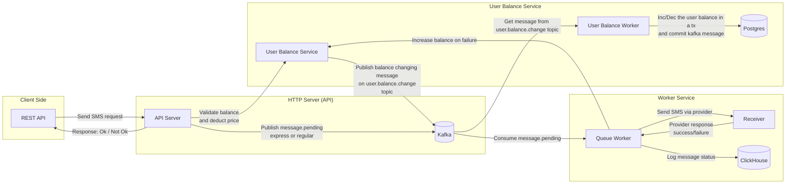
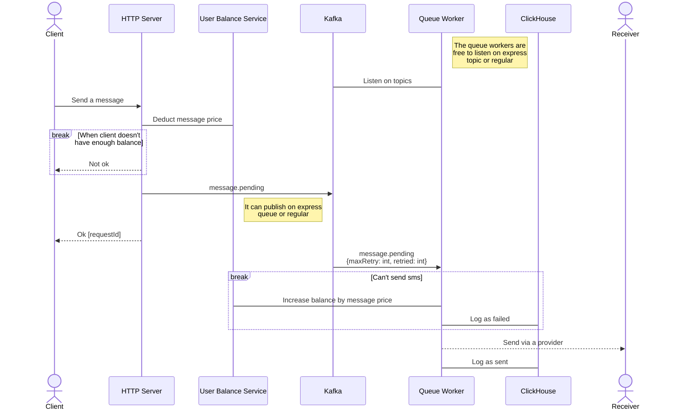
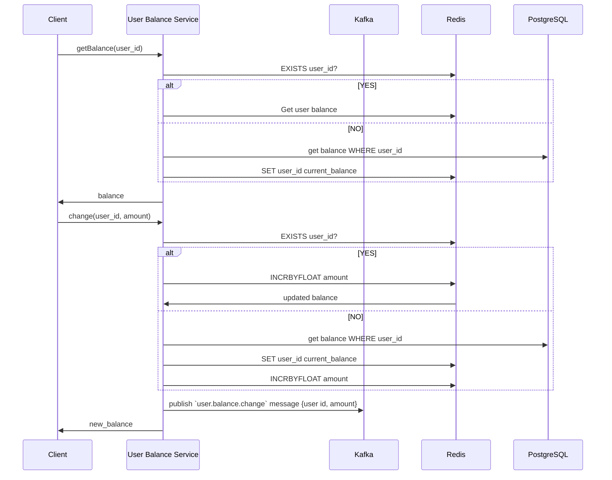
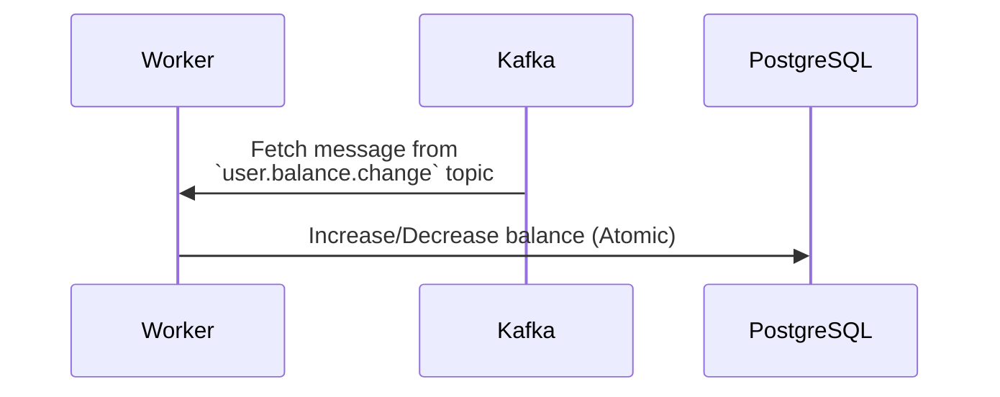

# System

## Flow

```mermaid
flowchart LR
    subgraph Client_Side["Client Side"]
        c[REST API]
    end

    subgraph Server_Side["HTTP Server (API)"]
        hs[API Server]
        mb[(Kafka)]
    end

    subgraph Worker_Side["Worker Service"]
        w[Queue Worker]
        r[Receiver]
        cdb[(ClickHouse)]
    end

    subgraph User_Balance_Side["User Balance Service"]
        pdb[(Postgres)]
        ubw[User Balance Worker]
        ubs[User Balance Service]
    end

    c -->|Send SMS request| hs
    hs -->|Validate balance<br/>and deduct price| ubs
    hs -->|Publish message.pending<br/>express or regular| mb
    hs -->|Response: Ok / Not Ok| c

    mb -->|Consume message.pending| w

    w -->|Send SMS via provider| r
    r -->|Provider response<br/>success/failure| w

    w -->|Log message status| cdb
    w -->|Increase balance on failure| ubs

    ubs -->|Publish balance changing message<br/> on user.balance.change topic| mb
    mb -->|Get message from user.balance.change topic| ubw
    ubw -->|Inc/Dec the user balance in a tx<br/>and commit kafka message| pdb
```

# Send message

## Sequence Diagram

```mermaid
sequenceDiagram
    Actor c as Client
    Participant s as HTTP Server
    Participant ubs as User Balance Service
    Participant mb as Kafka
    Participant w as Queue Worker
    Note right of w : The queue workers are<br>free to listen on express<br>topic or regular
    Participant cdb as ClickHouse
    Actor r as Receiver

w->mb : Listen on topics

c->>s : Send a message
s->ubs : Deduct message price

break When client doesn't have enough balance
    s-->>c : Not ok
end

s->>mb : message.pending
Note left of mb : It can publish on express<br>queue or regular
s-->>c : Ok [requestId]
mb->>w : message.pending<br>{maxRetry: int, retried: int}
break Can't send sms
    w->ubs : Increase balance by message price
    w->cdb : Log as failed
end
w-->>r: Send via a provider
w->cdb : Log as sent
```

# User Balance

## Service's Sequence

```mermaid
sequenceDiagram
    participant c as Client
    participant s as User Balance Service
    participant mb as Kafka
    participant r as Redis
    participant p as PostgreSQL

    c->>s: getBalance(user_id)
    s->>r: EXISTS user_id?
    alt YES
        s->>r: Get user balance
    else NO
        s->>p: get balance WHERE user_id
        s->>r: SET user_id current_balance
    end
    s->>c: balance

    c->>s: change(user_id, amount)
    s->>r: EXISTS user_id?
    alt YES
        s->>r: INCRBYFLOAT amount
        r->>s: updated balance
    else NO
        s->>p: get balance WHERE user_id
        s->>r: SET user_id current_balance
        s->>r: INCRBYFLOAT amount
    end
    s->>mb: publish `user.balance.change` message {user id, amount}
    s->>c: new_balance
```

## Worker's Sequence

```mermaid
sequenceDiagram
    participant w as Worker
    participant mb as Kafka
    participant p as PostgreSQL

    mb->>w: Fetch message from<br>`user.balance.change` topic
    w->>p: Increase/Decrease balance (Atomic)
```
