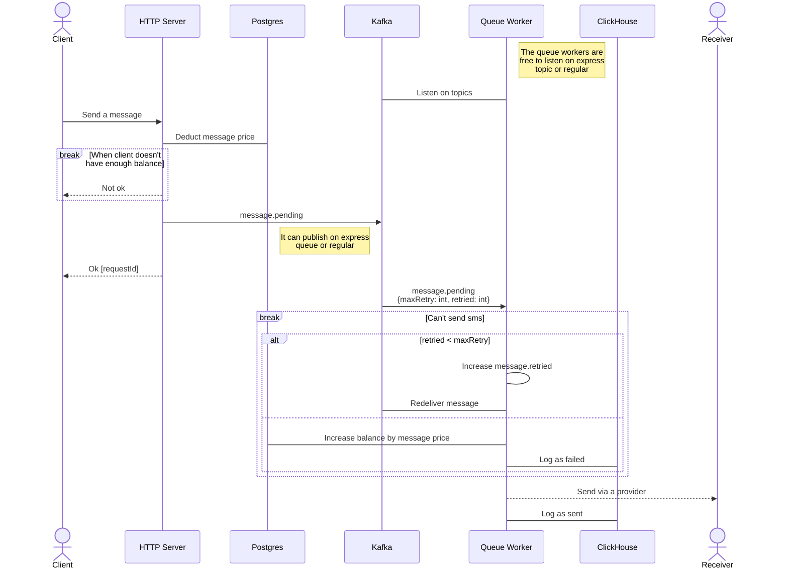
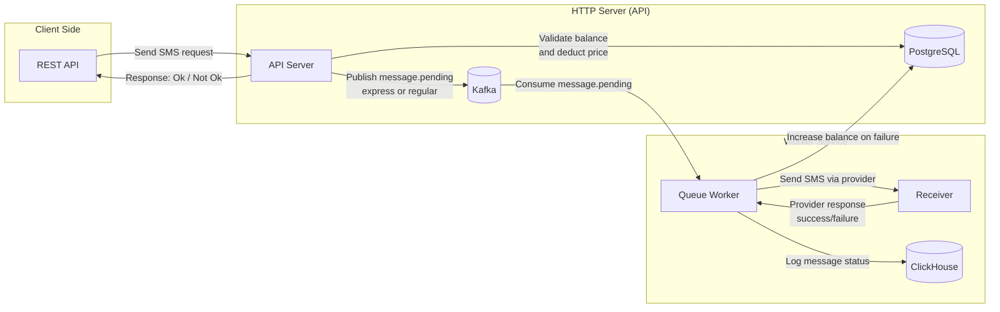

# Send message

## Sequence Diagram

```mermaid
sequenceDiagram
    Actor c as Client
    Participant s as HTTP Server
    Participant pdb as Postgres
    Participant mb as Kafka
    Participant w as Queue Worker
    Note right of w : The queue workers are<br>free to listen on express<br>topic or regular
    Participant cdb as ClickHouse
    Actor r as Receiver

w->mb : Listen on topics

c->>s : Send a message
s->pdb : Deduct message price

break When client doesn't have enough balance
    s-->>c : Not ok
end

s->>mb : message.pending
Note left of mb : It can publish on express<br>queue or regular
s-->>c : Ok [requestId]
mb->>w : message.pending<br>{maxRetry: int, retried: int}
break Can't send sms
    alt retried < maxRetry
        w->w : Increase message.retried
        w->mb : Redeliver message
    else
        w->pdb : Increase balance by message price
        w->cdb : Log as failed
    end
end
w-->>r: Send via a provider
w->cdb : Log as sent
```

## Flowchart

```mermaid
flowchart LR
    subgraph Client_Side["Client Side"]
        c[REST API]
    end

    subgraph Server_Side["HTTP Server (API)"]
        hs[API Server]
        pdb[(PostgreSQL)]
        mb[(Kafka)]
    end

    subgraph Worker_Side["Worker Service"]
        w[Queue Worker]
        r[Receiver]
        cdb[(ClickHouse)]
    end

    c -->|Send SMS request| hs
    hs -->|Validate balance<br/>and deduct price| pdb
    hs -->|Publish message.pending<br/>express or regular| mb
    hs -->|Response: Ok / Not Ok| c

    mb -->|Consume message.pending| w

    w -->|Send SMS via provider| r
    r -->|Provider response<br/>success/failure| w

    w -->|Log message status| cdb
    w -->|Increase balance on failure| pdb
```
