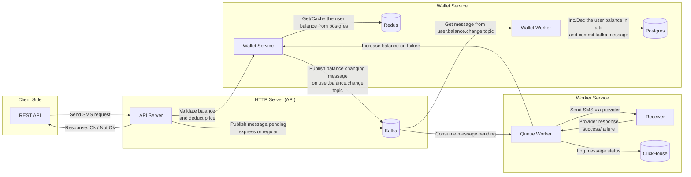
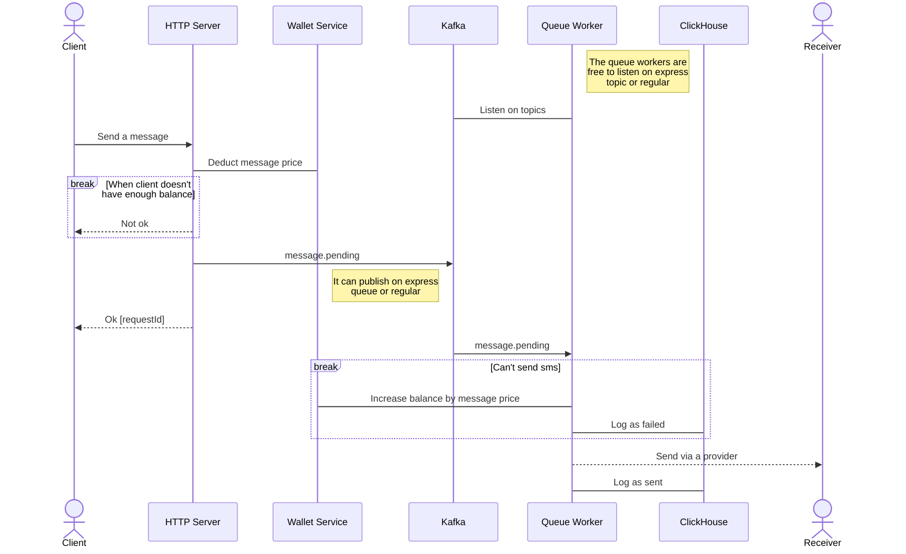
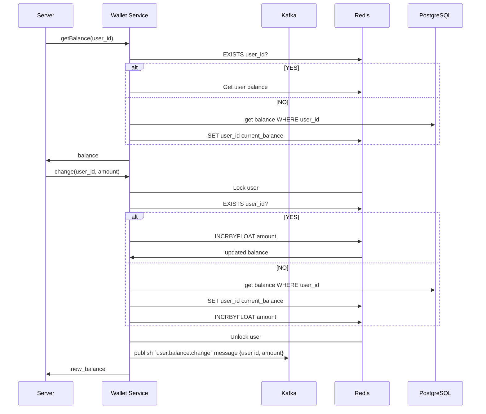
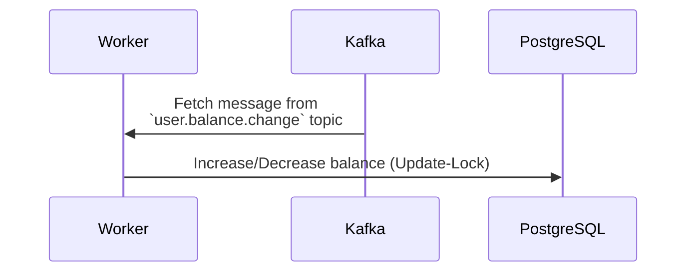

# System

## Flow

```mermaid
flowchart LR
    subgraph Client_Side["Client Side"]
        c[REST API]
    end

    subgraph Server_Side["HTTP Server (API)"]
        hs[API Server]
        mb[(Kafka)]
    end

    subgraph Worker_Side["Worker Service"]
        w[Queue Worker]
        r[Receiver]
        cdb[(ClickHouse)]
    end

    subgraph User_Balance_Side["Wallet Service"]
        pdb[(Postgres)]
        rdb[(Redus)]
        ubw[Wallet Worker]
        ubs[Wallet Service]
    end

    c -->|Send SMS request| hs
    hs -->|Validate balance<br/>and deduct price| ubs
    hs -->|Publish message.pending<br/>express or regular| mb
    hs -->|Response: Ok / Not Ok| c

    mb -->|Consume message.pending| w

    w -->|Send SMS via provider| r
    r -->|Provider response<br/>success/failure| w

    w -->|Log message status| cdb
    w -->|Increase balance on failure| ubs

    ubs -->|Get/Cache the user balance from postgres| rdb
    ubs -->|Publish balance changing message<br/> on user.balance.change topic| mb
    mb -->|Get message from user.balance.change topic| ubw
    ubw -->|Inc/Dec the user balance in a tx<br/>and commit kafka message| pdb
```

# Send message

## Sequence Diagram

```mermaid
sequenceDiagram
    Actor c as Client
    Participant s as HTTP Server
    Participant ubs as Wallet Service
    Participant mb as Kafka
    Participant w as Queue Worker
    Note right of w : The queue workers are<br>free to listen on express<br>topic or regular
    Participant cdb as ClickHouse
    Actor r as Receiver

w->mb : Listen on topics

c->>s : Send a message
s->ubs : Deduct message price

break When client doesn't have enough balance
    s-->>c : Not ok
end

s->>mb : message.pending
Note left of mb : It can publish on express<br>queue or regular
s-->>c : Ok [requestId]
mb->>w : message.pending
break Can't send sms
    w->ubs : Increase balance by message price
    w->cdb : Log as failed
end
w-->>r: Send via a provider
w->cdb : Log as sent
```

# Wallet

## Service's Sequence

```mermaid
sequenceDiagram
    participant hs as Server
    participant ws as Wallet Service
    participant mb as Kafka
    participant r as Redis
    participant p as PostgreSQL

    hs->>ws: getBalance(user_id)
    ws->>r: EXISTS user_id?
    alt YES
        ws->>r: Get user balance
    else NO
        ws->>p: get balance WHERE user_id
        ws->>r: SET user_id current_balance
    end
    ws->>hs: balance

    hs->>ws: change(user_id, amount)
    ws->r: Lock user
    ws->>r: EXISTS user_id?
    alt YES
        ws->>r: INCRBYFLOAT amount
        r->>ws: updated balance
    else NO
        ws->>p: get balance WHERE user_id
        ws->>r: SET user_id current_balance
        ws->>r: INCRBYFLOAT amount
    end
    ws->r: Unlock user
    ws->>mb: publish `user.balance.change` message {user id, amount}
    ws->>hs: new_balance
```

## Worker's Sequence

```mermaid
sequenceDiagram
    participant w as Worker
    participant mb as Kafka
    participant p as PostgreSQL

    mb->>w: Fetch message from<br>`user.balance.change` topic
    w->>p: Increase/Decrease balance (Update-Lock)
```
