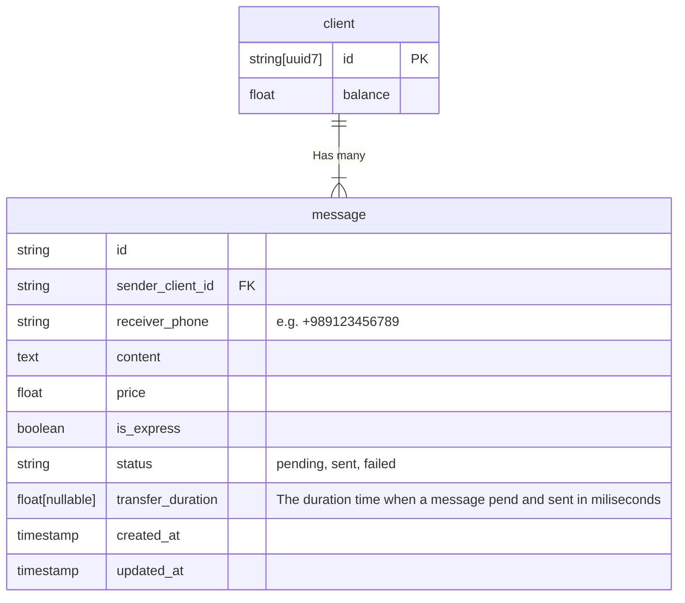

```mermaid
erDiagram
    client {
        string[uuid7] id PK
        float balance
    }
    message {
        string id
        string sender_client_id FK
        string receiver_phone "e.g. +989123456789"
        text content
        float price
        boolean is_express
        string status "pending, sent, failed"
		float[nullable] transfer_duration "The duration time when a message pend and sent in miliseconds"
		timestamp created_at
		timestamp updated_at
    }
	client 1 to 1+ message : "Has many"
```